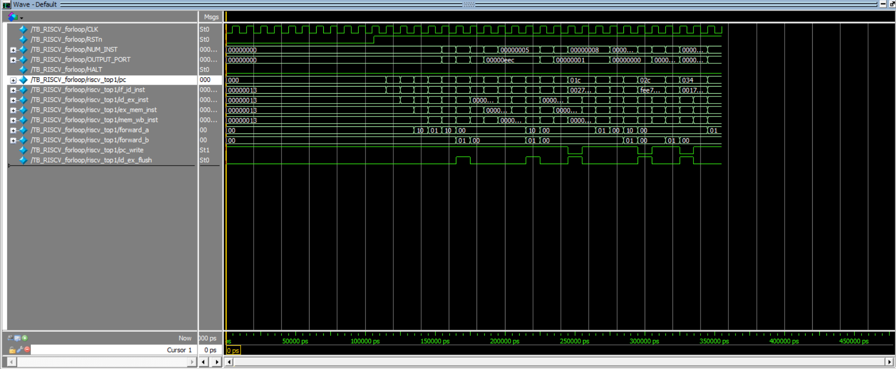
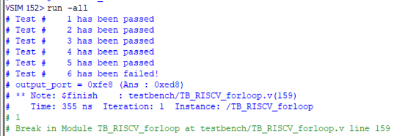
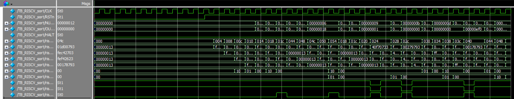
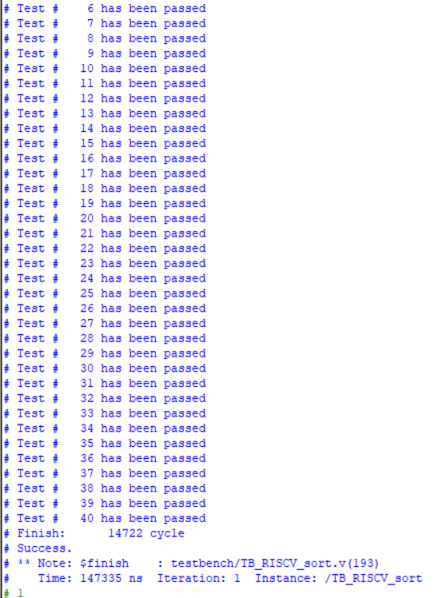

# ModelSim Simulation Results

This folder contains simulation evidence for the 5-stage pipelined RISC-V CPU.

The CPU was simulated using **ModelSim Intel FPGA Edition** with the provided Lab 5 testbench files. The waveform screenshots show pipeline activity, output-port behavior, forwarding signals, and hazard-control signals.

## Simulation Status

| Testbench | Status | Notes |
|---|---|---|
| `TB_RISCV_forloop.v` | Partially passing | Tests 1–5 pass; Test 6 fails due to store-address/output mismatch |
| `TB_RISCV_sort.v` | Partially passing | Similar result: reaches Test 6 and fails due to output mismatch |

The design is currently under active debugging. The included screenshots are not presented as full verification; they are included as simulation progress and waveform evidence.

## Forloop Simulation

The `forloop` testcase passes the first five checks, then fails at Test 6:

```text
Test # 1 has been passed
Test # 2 has been passed
Test # 3 has been passed
Test # 4 has been passed
Test # 5 has been passed
Test # 6 has been failed
output_port = 0xfe8 (Ans : 0xed8)
```

### Forloop Waveform

The waveform shows the CPU executing the `forloop` testcase. Visible signals include `CLK`, `RSTn`, `NUM_INST`, `OUTPUT_PORT`, `pc`, pipeline instruction registers, forwarding signals, and hazard-control signals.



### Forloop Console Output

This screenshot shows the partial passing result in the ModelSim transcript.



## Sort Simulation

The `sort` testcase passes the first five checks, then fails at Test 6:

```text
Test # 1 has been passed
Test # 2 has been passed
Test # 3 has been passed
Test # 4 has been passed
Test # 5 has been passed
Test # 6 has been failed
output_port = 0xfe8 (Ans : 0xed8)
```

### Sort Waveform

The `sort` testcase also shows active pipeline behavior in ModelSim. The waveform includes pipeline registers and forwarding/hazard signals during execution.



## Signals Shown in Waveforms

The screenshots focus on these signals:

```text
CLK
RSTn
NUM_INST
OUTPUT_PORT
HALT
pc
if_id_inst
id_ex_inst
ex_mem_inst
mem_wb_inst
forward_a
forward_b
pc_write
if_id_write
id_ex_flush
```
### Sort Console Output

This screenshot shows the partial passing result in the ModelSim transcript.



## Example ModelSim Commands

Use a generic project path, then compile and simulate:

```tcl
cd C:/path/to/Lab5

vlib work
vmap work work

vlog template/Mem_Model.v
vlog template/REG_FILE.v
vlog template/RISCV_CLKRST.v
vlog template/RISCV_main.v
vlog testbench/TB_RISCV_forloop.v

vsim -voptargs=+acc work.TB_RISCV_forloop
run -all
```

Example waveform setup for `forloop`:

```tcl
restart -f
delete wave *

add wave /TB_RISCV_forloop/CLK
add wave /TB_RISCV_forloop/RSTn
add wave -radix hex /TB_RISCV_forloop/NUM_INST
add wave -radix hex /TB_RISCV_forloop/OUTPUT_PORT
add wave /TB_RISCV_forloop/HALT

add wave -radix hex /TB_RISCV_forloop/riscv_top1/pc
add wave -radix hex /TB_RISCV_forloop/riscv_top1/if_id_inst
add wave -radix hex /TB_RISCV_forloop/riscv_top1/id_ex_inst
add wave -radix hex /TB_RISCV_forloop/riscv_top1/ex_mem_inst
add wave -radix hex /TB_RISCV_forloop/riscv_top1/mem_wb_inst

add wave -radix bin /TB_RISCV_forloop/riscv_top1/forward_a
add wave -radix bin /TB_RISCV_forloop/riscv_top1/forward_b
add wave /TB_RISCV_forloop/riscv_top1/pc_write
add wave /TB_RISCV_forloop/riscv_top1/if_id_write
add wave /TB_RISCV_forloop/riscv_top1/id_ex_flush

run 400ns
wave zoom full
```

For `sort`, replace `TB_RISCV_forloop` with `TB_RISCV_sort`.

## Notes

These simulations confirm that the design compiles, runs in ModelSim, and shows active 5-stage pipeline behavior. Full testcase completion is still under debugging.
